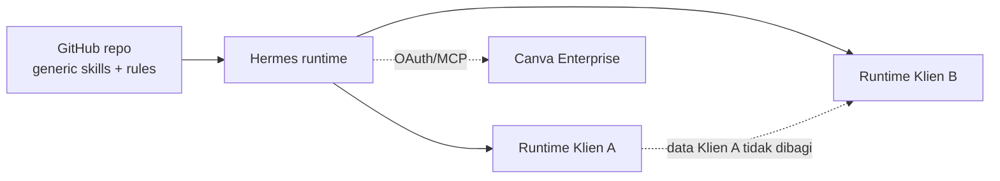

# Canva Hermes Skills

Public-safe, provider-aware Hermes skills for two bounded workflows:

- `brand-copy-studio` captures and validates an authorized copy system with
  evidence, rights, claims, templates, and provenance.
- `social-content-studio` turns an approved copy system into scoped social
  content specifications, review records, design handoffs, and export checks.

The package contains only generic skill instructions, templates, examples,
references, deterministic scripts, and tests. It contains no client material,
credentials, generated campaign content, export receipts, or runtime state.

## Cara kerja

Alur produksi memisahkan keputusan editorial dari mutasi Canva. Prompt-only
generation berguna untuk eksplorasi, tetapi bukan jalur produksi: copy, logo,
icon, layout, dan CTA tetap harus editable dan terstruktur.

```mermaid
flowchart LR
  A[Observation / source packet] --> B[Human Copy Brief]
  B --> C[3 distinct message premises]
  C --> D{Human selects premise}
  D --> E[Copy-quality audit]
  E --> F[Copy-to-layout contract]
  F --> G[Approved Canva template<br/>folder + controls]
  G --> H[Editable production<br/>and render]
  H --> I[Deterministic QA<br/>OCR · layout · semantic · WCAG · rights]
  I --> J{Human approval}
  J -- Revise --> E
  J -- Approve --> K[Export + download<br/>checksum + receipt]
  K --> L{Publish?}
  L -- No --> M[Handoff complete]
  L -- Yes --> N[Separate authorized<br/>publishing action]
  N --> O[Scoped runtime feedback,<br/>fingerprints, and measurement]
```



The Human Copy Brief records the audience situation, tension, point of view,
proof, claim boundaries, message jobs, and requested behavior. Premises must
differ in the idea or point of view, not merely in color, font, layout, or
synonym. The selected premise passes a copy-quality audit before it becomes a
copy-to-layout contract; Canva is production and collaboration, not the place
where an underspecified message is invented.

Existing tools may assist with mechanical style lint, structural evaluations,
regression comparisons, tracing, and provenance. They flag patterns and record
evidence; they do not supply taste, a human-quality score, or an authorship
detector. No external linter dependency ships with this repository, and no
automatic rewrite is a substitute for human copy judgment.

Inspect every rendered page with deterministic checks, and keep visual critique
and final approval human-led. Store rejection reasons, provenance, approval
records, checksums, and recent content fingerprints only in
tenant/client/product/brand-scoped runtime data.

Measure separate layers: human quality, production efficiency, audience
response, business outcomes, and risk. A slop index or detector score is
diagnostic telemetry, never an authorship label or a substitute for review.

### Canva foldering policy

Workflow-created designs use an explicit, scope-bound hierarchy:

```text
tenant/
└── client/
    └── product/
        └── brand/
            └── account/
                ├── approved-templates/
                ├── working/
                ├── review/
                └── approved-exports/
```

At runtime, resolve the exact tenant/client/product/brand/account scope first.
Resolve an existing authorized folder by its scoped identity; if it is absent,
create only that folder idempotently, then verify the returned folder ID before
creating a design. If scope or ownership is ambiguous, stop. Never reorganize,
rename, move, or clean up unrelated existing Canva assets. A runtime design
registry may retain opaque folder/design/template IDs and revisions, but those
records never enter this repository.

Repositori ini adalah lapisan instruksi dan validasi; data runtime tetap berada
di luar repositori. Persetujuan berjalan approval-first secara default, sedangkan
mode unattended hanya boleh aktif bila cakupan policy mengizinkannya.

Isolasi data berlaku per klien dan tetap terpisah dari aturan generik di repo:



## Prerequisites

- Python 3.10 or newer (the bundled tests use only the standard library).
- A Hermes installation capable of loading local skills.
- A Canva account and an OAuth-capable Hermes connector only when a Canva design
  or export action is requested.
- An authenticated policy source for approval or activation. A local draft can
  be validated without connecting a provider.

## Installation

### Local checkout

Copy this repository into the local skills directory configured for Hermes, or
point Hermes at this checkout. Keep the two directories below intact:

```text
skills/brand-copy-studio/
skills/social-content-studio/
```

### Hermes package install

The supported tap flow is:

```bash
hermes skills tap add Hasban-Fardani/canva-hermes-skills
hermes skills search <query> --source github
```

The two direct skill identifiers are:

```text
Hasban-Fardani/canva-hermes-skills/skills/brand-copy-studio
Hasban-Fardani/canva-hermes-skills/skills/social-content-studio
```

For the complete production workflow, inspect and install both skills in this
order. `social-content-studio` intentionally calls the brand bundle validator
from `brand-copy-studio` before privileged approval or export, so installing
only the social skill leaves that route fail-closed.

Use these confirmed commands:

```bash
hermes skills inspect Hasban-Fardani/canva-hermes-skills/skills/brand-copy-studio
hermes skills install Hasban-Fardani/canva-hermes-skills/skills/brand-copy-studio --category marketing --yes
hermes skills inspect Hasban-Fardani/canva-hermes-skills/skills/social-content-studio
hermes skills install Hasban-Fardani/canva-hermes-skills/skills/social-content-studio --category marketing --yes
```

Do not paste a credential into a command line. A private repository requires an
existing `GITHUB_TOKEN`, `GH_TOKEN`, or GitHub App Contents-read connection in
the Hermes environment. The installer copies only files referenced by each
`SKILL.md`; the bundled scripts are invoked with Python and do not depend on an
executable bit.

### GitHub access and rate limits

This public repository can be tapped anonymously. GitHub's anonymous API limit
is 60 requests per hour per network identity, and Hermes reads multiple support
files during inspection and installation. For servers and CI, use a
least-privilege `GITHUB_TOKEN`, `GH_TOKEN`, or GitHub App with Contents read;
authenticated API access provides up to 5,000 requests per hour and is more
stable for repeated installs. Set credentials through environment injection or
a secret manager. Never paste a token into a command, prompt, issue, log, or
repository.

Private repositories always require one of those authenticated read-only
connections. If `inspect` or `install` retries or becomes slow, check Hermes
logs for GitHub rate-limit responses and configure a read-only credential; do
not modify the skill files to work around a rate limit.

## Canva OAuth setup

1. Configure the Canva connector in Hermes using its OAuth flow and the least
   privilege required for the requested design, edit, or export action.
2. Start the connector's browser consent flow and complete consent in the
   provider's own page. Do not paste access tokens, refresh tokens, cookies, or
   client secrets into prompts, files, logs, or issue reports.
3. Verify the connector with a read-only capability check before creating or
   editing a design.
4. Treat every provider ID, design reference, and export result as scoped
   runtime data. Never copy it into this repository.

If OAuth is unavailable, both skills still produce a validated, provider-neutral
brief or manual Canva handoff.

## Approval modes

Approval is required by default. Attended work lets a human review the generated
candidate, confirm claims and rights, and approve the exact content/package
checksum before scheduling or publishing.

Bounded unattended work is an explicit, fail-closed exception. It requires a
separately authenticated policy, a matching current actor, an approved template
and claim set, an exact scope, and preapproved field slots. Anything outside the
allowlist returns to attended review. Unattended mode never authorizes a broader
brand, account, campaign, or provider scope.

Neither skill publishes content or reports a remote action as successful without
the corresponding confirmed tool result.

## Export and download

An export is considered downloaded only after a non-empty local file exists, its
SHA-256 checksum is computed, and a structured receipt is recorded by the
calling runtime. Signed export addresses are short-lived and must never be
stored, echoed, or committed. The bundled downloader validates HTTPS, bounds
redirects and response size, rejects private endpoints, and replaces output
atomically.

## Data directories

Runtime data belongs under the user's configured Hermes data root, outside this
repository. A typical layout is:

```text
<hermes-data-root>/social-content/brands/<tenant>/<client>/<brand>/
<hermes-data-root>/social-content/exports/
```

Use the actual data-root setting for the installed Hermes release. Do not add a
runtime directory, local absolute path, policy instance, export receipt, or
provider artifact to this repository.

## Tests and release checks

Run the two skill unit-test suites and the export downloader tests from the
repository root:

```bash
python3 skills/brand-copy-studio/scripts/test_validate_brand_bundle.py
python3 skills/social-content-studio/scripts/test_validate_content_spec.py
python3 skills/social-content-studio/scripts/test_download_canva_export.py
python3 scripts/check_public_release.py
```

The release checker enforces the public-safe allowlist, scans for local paths and
likely secrets, rejects runtime-looking JSON, and accepts additional private
markers only through test-only command-line arguments or the
`HERMES_RELEASE_MARKERS` environment variable. It never prints marker values.

## Install and contribution workflow

Install `brand-copy-studio` first, then `social-content-studio`, so the social
route can call the sibling brand validator before privileged approval or export.
For a repository change, use a branch, run the tests and release checker above,
then inspect the staged paths before committing:

```bash
git switch -c <change-name>
git diff --check
python3 scripts/check_public_release.py
git add README.md GUIDE.md SECURITY.md .gitignore scripts/check_public_release.py .github/workflows/quality.yml
git diff --cached --check
git diff --cached --name-only
git commit -m "docs: document production quality flow"
```

Only generic documentation, allowlisted skill files, validators, tests, and CI
belong in a commit. Brand evidence, generated content, runtime feedback,
fingerprints, approvals, measurements, exports, and receipts stay outside the
repository even when a local workflow uses them.

## Privacy

Treat supplied brand evidence, account identifiers, policy records, OAuth
metadata, provider IDs, signed export addresses, and performance data as
confidential runtime data. Keep them in the configured local data root or the
provider's secure vault, apply the owner's retention policy, and share only the
minimum handoff needed for the next authorized step. This repository is a
generic distribution artifact; contributions containing client or account data
will be rejected.

See [GUIDE.md](GUIDE.md) for the concise operating guide and [SECURITY.md](SECURITY.md)
for the release and disclosure policy.
